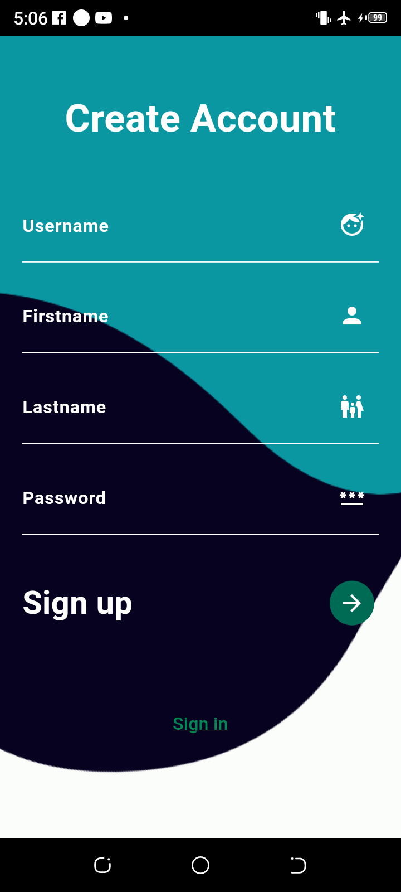
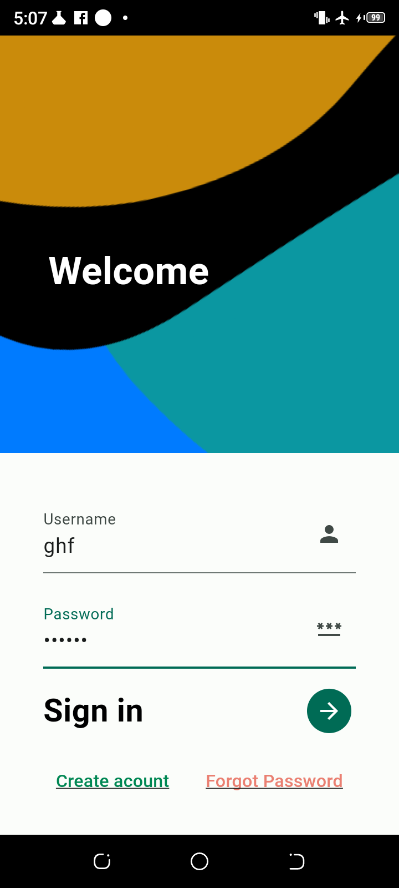
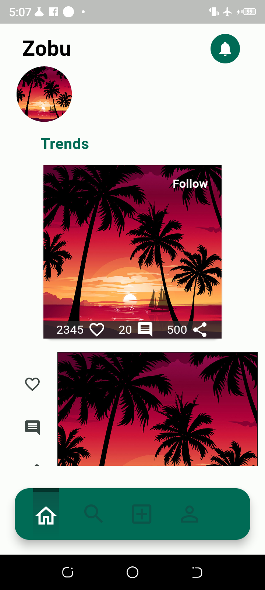
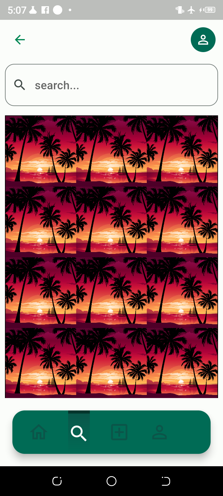
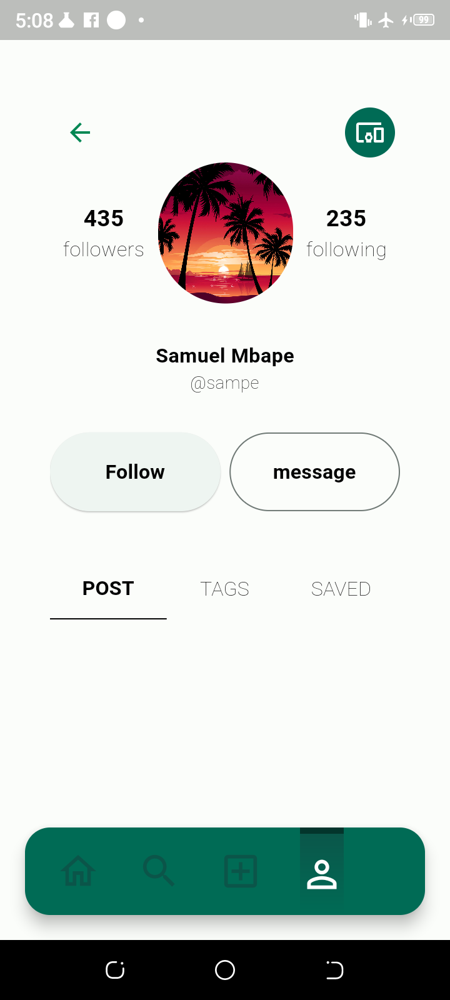

# zobu

It is a simple template to illustrate the flow of a social media application

## Getting Started

### Step 1
Create Acccount 

### Step 2
Signin with you acccount 

### Step 3
Use the Bottom navigation to navigate through slides 

### Step 4
Click on images to link you to profile page 

